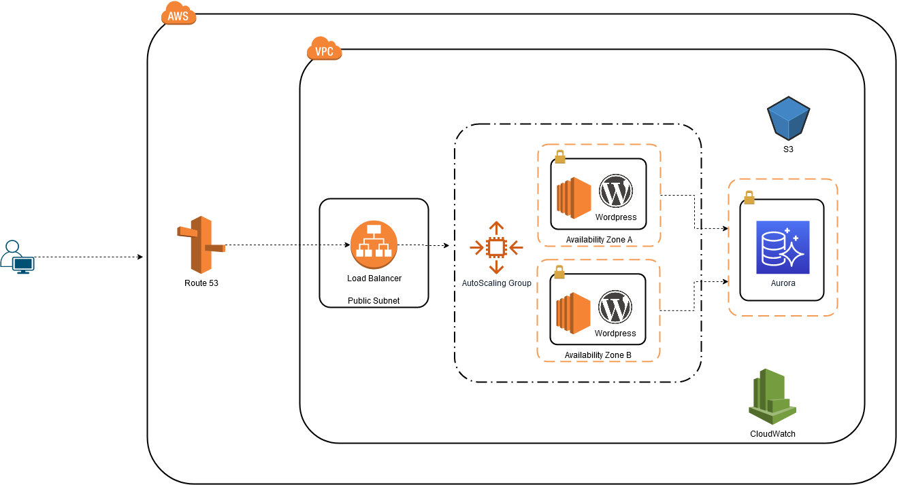

# Nettycoons Wordpress Architecture

## Purpose

This repository has a scripts and templates to deploy Wordpress websites using Infrastructure as a Code (IaC) technique.



## Source code structure

```bash
├── cloudformation                          <-- cloudformation template for cicd pipeline
│   └── aurora-db.yml
│   └──backup-s3-bucket.yml
│   └──wordpress-asg.yml
├── docs                                    <-- Documentation files
│   └── images
│   └── wordpres-architecture.png
├── scripts                                 <-- Utility scripts
│   └── backup-to-s3.sh
├── README.md                               <-- Readme file
```

### Cloudformation template

Cloudformation will create the following resources as part of the Creating EMR Resources Process:

* ``cloudformation/aurora-db.yml``
    + DB Alarm SNS Topic
    + Database SubnetGroup
    + Database Cluster ParameterGroup
    + Aurora Database Cluster
    + Aurora Datbase Instrance
    + CloudWatch Alarms
* ``cloudformation/backup-s3-bucket``
    + S3 Bucket
* ``cloudformation/wordpress-asg.yml``
    + AutoScaling Group
    + Launch Template
    + EC2 IAM Role

### AutoScaling

The wordpress instance is running behind an autoscaling group with min and max capacity of 1 instance.

If the instance is terminated due to any reason, the autoscaling group will replace it with a new instance. The new instance will pull the latest backup from the S3 bucket and setup the website.

### Backup and Restore

As part of the instances boostrap script, a backup script will be installed as a cron job. This job will run once a day and create a backup zip file and upload it to S3 bucket. This buckup file wil be prefixed with the datestamp of the backup date to make it easy for the backup restore process.
